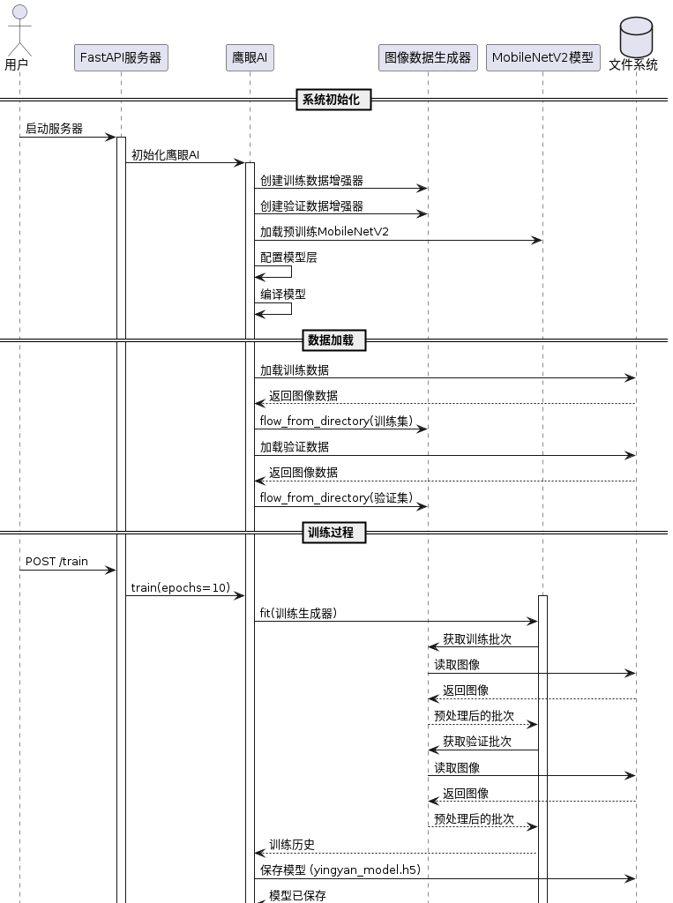

# 鹰眼AI (YingYan AI)

基于人工智能的计算机视觉系统，专注于智能图像分析与处理。使用 MobileNetV2 架构实现高效的图像分类功能。

## 项目概述

鹰眼AI是一个先进的计算机视觉平台，利用深度学习技术提供精确且高效的视觉智能解决方案。本系统采用迁移学习方法，基于预训练的 MobileNetV2 模型，提供快速且准确的图像分类服务。

## 核心功能

- 智能图像分类
- REST API 服务
- 自动模型训练
- 实时预测接口
- 数据自动采集

## 技术栈

- TensorFlow 2.x
- FastAPI
- MobileNetV2
- Python 3.6+

## 项目结构

```bash
YiShouAI/
├── src/                  # 源代码目录
│   ├── YingYanAI.py     # 核心AI模型实现
│   ├── app.py           # FastAPI 服务实现
│   ├── download_data.py # 数据采集工具
│   └── logger_config.py # 日志配置
├── tools/               # 实用工具目录
│   └── predict_test.py  # 预测功能测试工具
├── models/              # 模型存储目录
│   ├── yingyan_model.h5 # 训练后的模型文件
│   └── class_names.txt  # 类别名称映射文件
├── images/              # 图像数据目录
│   ├── train/          # 训练数据集
│   │   ├── {关键词1}/  # 根据搜索关键词自动创建的类别目录
│   │   └── {关键词2}/  # 根据搜索关键词自动创建的类别目录
│   ├── validation/     # 验证数据集
│   └── test/          # 测试数据集
├── log/                # 日志文件目录
│   └── *.log          # 运行日志文件
└── README.md          # 项目说明文档
```


## 快速开始
### 环境要求

```bash
# 安装依赖
pip install tensorflow fastapi uvicorn python-multipart pillow icrawler

# 创建必要的目录
mkdir -p images/train images/validation models log
```


### 数据采集与准备
#### 使用数据采集工具：

创建必要的数据目录：
```bash
mkdir -p images/{train,validation,test}
```

使用数据采集工具：
```bash
python src/download_data.py
```

关键词格式说明：

- 使用下划线连接多个单词
- 示例关键词格式：

```plaintext
  elon_musk          # 人物类别
  cute_cat           # 动物类别
  red_apple          # 物品类别
  sport_car          # 交通工具
  modern_building    # 建筑类别
```

示例操作：
```bash
请输入搜索关键词: porn_nude # 限制级内容
# 或
请输入搜索关键词: apple     # 普通内容
是否为训练集？(y/n): y
需要下载多少张图片？(默认: 5): 10
```

注意：请确保在 images 目录下创建以下子目录：

- train/ : 训练数据集
- validation/ : 验证数据集
- test/ : 测试数据集


### 启动服务

1. 开发环境
```bash
uvicorn src.app:app --host 0.0.0.0 --port 8000 --reload
```

2. 生产环境
```bash
uvicorn src.app:app --host 0.0.0.0 --port 8000 --workers 4
```

服务将在 http://localhost:8000 启动，可通过 http://localhost:8000/docs 访问交互式 API 文档。

## API 使用说明

### 预测接口

- 端点：`POST /predict`
- 功能：上传图片进行分类预测
- 示例：

```bash
curl -X POST "http://localhost:8000/predict" \
     -H "accept: application/json" \
     -H "Content-Type: multipart/form-data" \
     -F "file=@/path/to/your/image.jpg"
```

### 预测测试工具

位于 tools/predict_test.py ，用于快速测试模型的预测功能。

使用方法：
> 确保 API 服务已启动

```bash
python tools/predict_test.py
```

输出示例：

```bash
[鹰眼 AI]: 2025-02-04 03:46:15,189 - **main** - INFO - 鹰眼 AI 图像预测测试工具启动
[鹰眼 AI]: 2025-02-04 03:46:15,189 - **main** - INFO - ==============================
[鹰眼 AI] 请拖拽图片到此处: '/path/to/images/train/porn_nude/000001.jpg'
[鹰眼 AI]: 2025-02-04 03:46:19,696 - **main** - INFO - 正在处理图片: 000001.jpg
[鹰眼 AI]: 2025-02-04 03:46:20,477 - **main** - INFO - 预测结果:
[鹰眼 AI]: 2025-02-04 03:46:20,477 - **main** - INFO - 类别: 1
[鹰眼 AI]: 2025-02-04 03:46:20,477 - **main** - INFO - 置信度: 98.90%
```


功能特点：

- 支持拖拽图片文件进行测试
- 自动验证图片格式（支持 jpg、jpeg、png、bmp）
- 详细的日志记录
- 友好的中文交互界面
- 显示预测结果和置信度
  
示例输出:
```bash
[鹰眼 AI] 2024-02-04 15:30:45 - INFO - 鹰眼 AI 图像预测测试工具启动
[鹰眼 AI] ==============================
[鹰眼 AI] 请拖拽图片到此处: /path/to/image.jpg
[鹰眼 AI] 正在处理图片: image.jpg
[鹰眼 AI] 预测结果:
[鹰眼 AI] 类别: 1
[鹰眼 AI] 置信度: 95.23%
```

响应格式：

```json
{
  "success": true,
  "predicted_class": 0,
  "confidence": 0.95
}
```

## 特性

- 自动数据增强
- 迁移学习
- 模型自动训练
- RESTful API
- 实时预测
- 详细的日志记录

## 注意事项

- 确保训练数据集在 `images/train` 目录下按类别分类
- 验证数据集放置在 `images/validation` 目录下
- 首次启动服务时如果没有预训练模型会自动开始训练
- 所有操作日志都会记录在 `log` 目录下

## 系统要求

- CPU 或 GPU (推荐)
- 内存：4GB 以上
- 磁盘空间：500MB 以上

## 算法



## 评估模型：
在 `src/YingYanAI.py` 中添加以下代码来评估模型性能：

```python
from sklearn.metrics import classification_report

# 加载测试数据

test_generator = val_datagen.flow_from_directory(
  "images/test",
  target_size=img_size,
  batch_size=batch_size,
  class_mode="categorical",
  shuffle=False
)

# 评估模型

predictions = yyi.model.predict(test_generator)
y_pred = tf.argmax(predictions, axis=1).numpy()
y_true = test_generator.classes

print(classification_report(y_true, y_pred))

```

## 预测新图像：
使用保存的模型对新图像进行预测：
```python
from tensorflow.keras.models import load_model

model = load_model("models/yingyan_model.h5")
image_path = "path_to_image.jpg"

img = tf.keras.preprocessing.image.load_img(image_path, target_size=(224, 224))
img_array = tf.keras.preprocessing.image.img_to_array(img)
img_array = tf.expand_dims(img_array, 0) # 添加批次维度

predictions = model.predict(img_array)

print(f"预测结果: {predictions}")
```

## 参数说明
## 参数说明

| 参数名     | 说明               | 默认值           |
| ---------- | ------------------ | ---------------- |
| train_dir  | 训练数据目录路径   | `"images/train"` |
| img_size   | 图像处理的目标尺寸 | `(224, 224)`     |
| batch_size | 批处理大小         | `32`             |
| epochs     | 训练周期数         | `10`             |

> 注：
>
> - img_size 必须为 (224, 224)，这是 MobileNetV2 的要求
> - batch_size 可根据可用内存大小调整
> - epochs 可根据训练效果调整

## 模型架构
1. MobileNetV2：作为基础特征提取器，使用 ImageNet 预训练权重。
2. 全局平均池化：将特征图压缩为一维向量。
3. Dropout：随机丢弃 50% 神经元，防止过拟合。
4. 全连接分类层：使用 Softmax 激活函数进行多分类。

## 性能评估
#### 评估指标
- 准确率 (Accuracy)：模型预测正确的比例。
- 召回率 (Recall)：真正例中被正确预测的比例。
- F1 分数：综合衡量模型的精度和召回率。


## 模型评估报告

| 类别         | Precision | Recall | F1-Score | Support |
| ------------ | --------- | ------ | -------- | ------- |
| 0            | 0.95      | 0.94   | 0.95     | 34      |
| 1            | 0.96      | 0.97   | 0.96     | 36      |
| **准确率**   | -         | -      | 0.95     | 70      |
| **宏平均**   | 0.95      | 0.95   | 0.95     | 70      |
| **加权平均** | 0.95      | 0.95   | 0.95     | 70      |

> 注：
>
> - Precision: 精确率
> - Recall: 召回率
> - F1-Score: F1 分数
> - Support: 样本数量

### 个人捐赠支持

如果您认为该项目对您有所帮助，并且愿意个人捐赠以支持其持续发展和维护，🥰 我非常感激您的慷慨。
您的捐赠将帮助我继续改进和添加新功能到该项目中。 通过财务捐赠，您将有助于确保该项目保持免
费和对所有人开放。即使是一小笔捐款也能产生巨大的影响，也是对我个人的鼓励。

### 国内支付方式

<div align="center">
<table>
<tr>
<td align="center" width="300">

<br />
<strong>微信支付</strong>
</td>
<td align="center" width="300">

<br />
<strong>支付宝</strong>
</td>
</tr>
</table>
</div>

### 国际支付渠道

<div align="center">

[](https://qr.alipay.com/fkx19369scgxdrkv8mxso92)
[](https://ko-fi.com/F1F5VCZJU)
[](https://www.paypal.com/paypalme/ctkqiang)
[](https://donate.stripe.com/00gg2nefu6TK1LqeUY)

</div>

### 关注作者

<div align="center">

#### 专业平台

[](https://github.com/ctkqiang)
[](https://www.linkedin.com/in/ctkqiang/)
[](https://stackoverflow.com/users/10758321/%e9%92%9f%e6%99%ba%e5%bc%ba)

#### 社交媒体

[](https://www.facebook.com/JohnMelodyme/)
[](https://www.instagram.com/ctkqiang)
[](https://twitch.tv/ctkqiang)

[](https://github.com/ctkqiang)
[](https://github.com/ctkqiang/ctkqiang/blob/main/assets/IMG_9245.JPG?raw=true)

</div>
